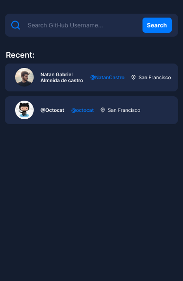
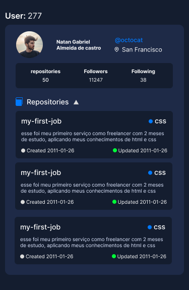

# APP Github Finder

Bem-vindo ao Github Finder! Este repositório contém o código fonte e os recursos relacionados à interface do usuário do projeto.

### Instalar

[Android](https://expo.dev/artifacts/eas/3Vx4BeazgMPh7fSxw83ZpQ.apk)

### Demostrativo do aplicativo
https://youtube.com/shorts/uMJ90ypfd04?feature=share

### Layout 

Figma: [Layout Figma Search Github User](https://www.figma.com/file/4yeXuWGDjdqocKQzizDUcX/Search-Github-User?type=design&node-id=0%3A1&mode=design&t=jCxqnXiXgC49KoDv-1)


 


## Tecnologias Utilizadas

O front-end do projeto foi desenvolvido utilizando as seguintes tecnologias e ferramentas:

- **React Native:** Um framework para construir aplicações nativas usando React e JavaScript.
- **TypeScript:** Um superset de JavaScript que adiciona tipagem estática à linguagem.
- **Styled-Components:** Uma biblioteca para estilizar componentes React.

## Estrutura do Projeto

A estrutura do projeto está organizada da seguinte forma:

  - **assets/:** Contém arquivos estáticos, como imagens e ícones.
  - **src/:** Contém o código-fonte da aplicação.
    - **@types/:** Contém as definições de tipo para o TypeScript.
    - **components/:** Contém os componentes React reutilizáveis.
      - **ui/:** Contém componentes de interface do usuário reutilizáveis, como input, card, avatar...
    - **hooks/:** Contém os hooks personalizados do React.
    - **routes/:** Contém a definição das rotas da aplicação.
    - **screens/:** Contém os componentes de tela da aplicação.
    - **services/:** Contém os serviços usados na aplicação, como chamadas de API.
  - **App.tsx/:** Componente que representam seções inteiras da aplicação.

## Rodando o APP

### Pré-requisitos

Antes de começar, certifique-se de ter instalado em sua máquina:

- [Node.js](https://nodejs.org/)
- [npm](https://www.npmjs.com/) 
- [Git](https://git-scm.com/)
- [android Studio](https://developer.android.com/studio?hl=pt-br) ou um aparelho mobile com Expo instalado Expo: [android](https://play.google.com/store/search?q=expo&c=apps), [IOS](https://apps.apple.com/br/app/expo-go/id982107779)

### Configuração do Ambiente

1. **Clone o Repositório:**
```bash
    git clone https://github.com/0rogerinho/github-user-search-technical-challenge.git
```

2. **Instale as dependências**

Navegue até a pasta do projeto e instale as dependências:

 ```cd search-github-user
    npm install
  ```
3. **Inicie o servidor de desenvolvimento**

Agora você pode iniciar o servidor de desenvolvimento:

```
npm run start
```

caso não consiga abrir o expo em seu aparelho celular com o qr code, inicie o servidor com: 

```
npm run tunnel
```

Agora, o servidor de desenvolvimento deve estar rodando e você pode selecionar como gostaria de ver o aplicativo (Android, IOS, Web ou Android Studio).
